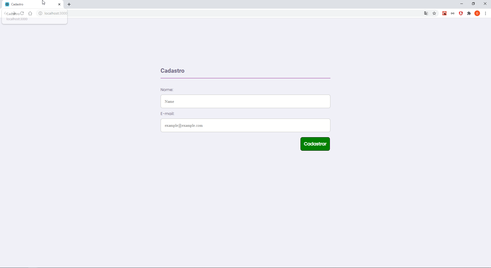
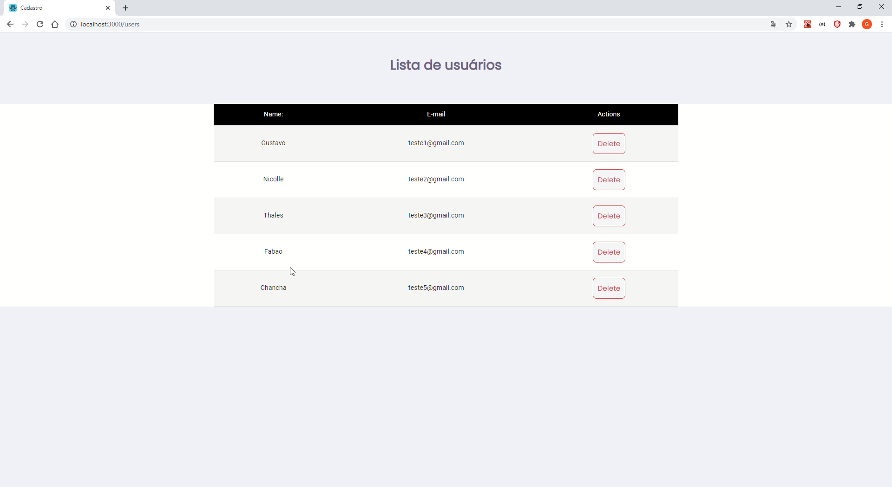

## Registro de usuários
Aplicação criada para realizar o registro de usuários e confirmação de registro via e-mail.

### Tecnologias utilizadas
+ NodeJS + Sequelize + Docker + Postgres + NodeMailer -> (Backend)
+ ReactJS -> (Web)

### Objetivo
A idéia deste projeto é me tirar da zona de conforto e práticar usar outras tecnologias que não knex e sqlite3, então optei pelo postgres junto ao docker pois acredito que são tecnologias amplamente utilizadas e crescentes, então nada melhor que ter conhecimento nelas. Usei a ORM sequelize para trabalhar com a parte de querys para o banco.

### Confirmação por e-mail
Quando o usuário se cadastra ele recebe via e-mail uma agradecimento, não de fato uma confirmação. Pretendo que no futuro haja a confirmação e
só então após a confirmação os dados do usuário sejam salvos no banco de dados.

### Pagina 404 not found
Adicionado destino 404 para endereços não programados, a pagina 404 em si é só uma arrow function que retorna um div com a mensagem 404 not found.

### Listagem de usuários cadastrados
Agora a listagem está melhor estilizada com opção de excluir um registro existente.

### Imagens de como está o projeto

### Tela de registro

### Tela de listagem
